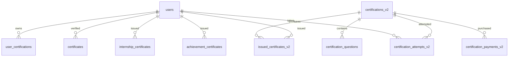
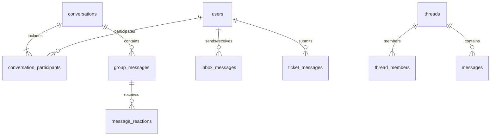

# SARTHI — Target Clean Database Schema & Migration Spec (TARGET-SCHEMA.md)

> **Document Version:** 2.1 (Strict Verified No-Functionality-Loss & No-Data-Loss Architecture)  
> **Target Database Engine:** Hostinger Production MySQL (`u402587352_sarthi`)  
> **ORM Framework:** Next.js + Prisma v5.22.0  
> **Governance Rule:** Zero Destructive Operations. No `DROP TABLE` or `DELETE FROM` statements allowed.

---

## 1. Strict No-Data-Loss & No-Functionality-Loss Archival Principles

Every table modification or deprecation follows this **non-negotiable safety policy**:

1. **Active Table Protection Policy**:
   - **NO table with active runtime CRUD references in application routes is ever archived.**
   - Following deep inspection, `certificates` (21 rows, active in `/verify` & studio), `platform_activities` (415 rows, active in admin logger), `messages` (active in `/api/messages`), `threads`, and `thread_members` are explicitly **retained as active operational tables**.
2. **Full Logical Backup & Restore Test**:
   - `mysqldump --single-transaction --routines --triggers` of the full production database saved to external storage.
   - Restored and verified against a scratch MySQL instance before executing any schema changes.
3. **Pre-Archival Snapshot**:
   - Execute `SELECT COUNT(*) FROM <table>` and `CHECKSUM TABLE <table>` prior to rename.
4. **Atomic Zero-Downtime Rename**:
   - Replace any drop/copy sequence with atomic MySQL rename:
     ```sql
     RENAME TABLE old_table_name TO old_table_name_archived_20260731;
     ```
5. **Instant Rollback Guarantee**:
   - If monitoring detects an issue, execute instant reverse atomic rename:
     ```sql
     RENAME TABLE old_table_name_archived_20260731 TO old_table_name;
     ```
6. **Post-Archival Verification**:
   - Re-verify row count and checksum on the `_archived_20260731` table to prove 100% data fidelity.

---

## 2. Canonical Source of Truth & Retained Active Domains

### A. Certificates & Credentials Domain (Active & Co-existing)
- **Paid Certification Exam Definition**: `certifications_v2` (Model: `Certification`)
- **Exam Question Bank**: `certification_questions` (Model: `CertificationQuestion`)
- **Exam Student Attempts**: `certification_attempts_v2` (Model: `CertificationAttempt`)
- **Exam Razorpay Payments**: `certification_payments_v2` (Model: `CertificationPayment`)
- **Exam Pre-registrations**: `certification_registrations_v2` (Model: `CertificationRegistration`)
- **Issued Exam Certificates**: `issued_certificates_v2` (Model: `IssuedCertificate`)
- **Issued Internship Certificates**: `internship_certificates` (Model: `InternshipCertificate`)
- **Issued Olympiad & Achievement Badges/Certs**: `achievement_certificates` (Model: `AchievementCertificate`)
- **User Profile Cert List**: `user_certifications` (Model: `UserCertification`)
- **Public Verification & Studio Certificates**: `certificates` (Model: `Certificate` — **RETAINED ACTIVE**, 21 rows in `/verify` route)

### B. Messaging & Communication Domain (Active & Co-existing)
- **Direct & Group Conversations**: `conversations` (Model: `Conversation`)
- **Conversation Members**: `conversation_participants` (Model: `ConversationParticipant`)
- **Conversation Chat Messages**: `group_messages` (Model: `ChatMessage`)
- **Message Emoji Reactions**: `message_reactions` (Model: `MessageReaction`)
- **Teacher/Mentor Inbox Messages**: `inbox_messages` (Model: `InboxMessage`)
- **Support Ticket Messages**: `ticket_messages` (Model: `TicketMessage`)
- **Live Seminar Chat Stream**: `seminar_chat_messages` (Model: `SeminarChatMessage`)
- **Thread Communication Engine**: `threads` (Model: `Thread`), `thread_members` (Model: `ThreadMember`), `messages` (Model: `Message`) — **RETAINED ACTIVE** for thread APIs

### C. Live Classes & Attendance Domain
- **LiveKit Class Sessions**: `live_classes` (Model: `LiveClass`)
- **Class Attendance Records**: `live_class_attendances` (Model: `LiveClassAttendance`)
- **Live Room Participants**: `live_participants` (Model: `LiveParticipant`)
- **Livekit Session Tracker**: `live_sessions` (Model: `LiveSession`)
- **Class Recording Catalog**: `live_class_recordings` (Model: `LiveClassRecording`)
- **LiveKit Egress Recordings**: `recordings` (Model: `Recording`)
- **Internship Daily Attendance**: `internship_attendances` (Model: `InternshipAttendance`)

### D. Audit Logging & System Telemetry Domain
- **Core System Audit Trail**: `audit_logs` (Model: `AuditLog`) — Canonical log for offer letters, status changes, admin actions
- **Platform Activity Ledger**: `platform_activities` (Model: `PlatformActivity` — **RETAINED ACTIVE**, 415 rows in admin logger)
- **Authentication & Security Audit**: `security_events` (Model: `SecurityEvent`)
- **API Request Telemetry**: `api_logs` (Model: `ApiLog`)
- **Transactional Email Dispatch Logs**: `email_logs` (Model: `EmailLog`)
- **YouTube Integration Telemetry**: `youtube_audit_logs` (Model: `YouTubeAuditLog`)
- **Marketing Audit Trail**: `marketing_audit_logs` (Model: `MarketingAuditLog`)

### E. Gamification & XP System Domain
- **XP Ledger & Points History**: `xp_transactions` (Model: `XpTransaction`)
- **Cached Leaderboard Rankings**: `leaderboard_positions` (Model: `LeaderboardPosition`)
- **Olympiad Badges**: `olympiad_badges` (Model: `OlympiadBadge`)
- **Internship Badges**: `internship_badges` (Model: `InternshipBadge`)
- **Achievements Master Catalog**: `achievements` (Model: `Achievement`)
- **Earned User Achievements**: `user_achievements` (Model: `UserAchievement`)

---

## 3. Naming Standardization Map (`PascalCase` -> `snake_case`)

All 16 `PascalCase` tables are mapped to clean `snake_case` names using explicit `@@map` directives:

| # | Current Physical Table | Model Name | Proposed Physical Name / `@@map` | Status | Action Type |
| :--- | :--- | :--- | :--- | :---: | :--- |
| 1 | `ActivityLog` | `ActivityLog` | `@@map("activity_log_archived_20260731")` | `SCRIPT-ONLY` | Atomic Archive |
| 2 | `CourseYouTubeMapping` | `CourseYouTubeMapping` | `@@map("course_youtube_mappings")` | `RELATION-ONLY` | Standardize Map |
| 3 | `LiveAttendance` | `LiveAttendance` | `@@map("live_attendance_archived_20260731")` | `NO-REF` | Atomic Archive |
| 4 | `MetricOverride` | `MetricOverride` | `@@map("metric_overrides")` | `ACTIVE` | Standardize Map |
| 5 | `PaymentIntent` | `PaymentIntent` | `@@map("payment_intents")` | `ACTIVE` | Standardize Map |
| 6 | `Profile` | `Profile` | `@@map("profiles")` | `ACTIVE` | Standardize Map |
| 7 | `Project` | `Project` | `@@map("projects")` | `ACTIVE` | Standardize Map |
| 8 | `ProjectInterest` | `ProjectInterest` | `@@map("project_interests")` | `ACTIVE` | Standardize Map |
| 9 | `RecordingAnalytics` | `RecordingAnalytics` | `@@map("recording_analytics_archived_20260731")` | `NO-REF` | Atomic Archive |
| 10 | `Streak` | `Streak` | `@@map("streak_archived_20260731")` | `NO-REF` | Atomic Archive |
| 11 | `StudyGroup` | `StudyGroup` | `@@map("study_groups")` | `NO-REF` | Atomic Archive |
| 12 | `Thumbnail` | `Thumbnail` | `@@map("thumbnails")` | `ACTIVE` | Standardize Map |
| 13 | `Transcription` | `Transcription` | `@@map("transcriptions")` | `NO-REF` | Atomic Archive |
| 14 | `UnmatchedQuery` | `UnmatchedQuery` | `@@map("unmatched_queries")` | `ACTIVE` | Standardize Map |
| 15 | `XPTransaction` | `XPTransaction` | `@@map("xp_transaction_archived_20260731")` | `NO-REF` | Atomic Archive |
| 16 | `_StudyGroupMembers` | `_StudyGroupMembers` | `@@map("_study_group_members")` | `RELATION-ONLY` | Standardize Map |

---

## 4. Target Domain ERD Diagrams (Mermaid)

### A. Certifications & Credentials Domain ERD


### B. Messaging & Real-time Communication Domain ERD


---

## 5. Verified Safe Archival Ledger (36 Truly Dead Tables)

The following **36 tables** are verified to have **ZERO runtime CRUD calls** in application code and are safe for atomic rename to `_archived_20260731`. Zero active tables are included. Zero rows are deleted.

| # | Table Name | Rows | Size (KB) | Domain | Verified Code Status | Target Archival Name |
| :--- | :--- | :---: | :---: | :--- | :---: | :--- |
| 1 | `_StudyGroupMembers` | 0 | 32 KB | Courses & Lessons | **NO-REFERENCES-FOUND** | `_StudyGroupMembers_archived_20260731` |
| 2 | `accounts` | 0 | 48 KB | Auth & User Management | **SCRIPT-ONLY** | `accounts_archived_20260731` |
| 3 | `admin_action_logs` | 0 | 48 KB | Admin, Audit Logs & Security | **NO-REFERENCES-FOUND** | `admin_action_logs_archived_20260731` |
| 4 | `admin_cache` | 0 | 64 KB | Admin, Audit Logs & Security | **NO-REFERENCES-FOUND** | `admin_cache_archived_20260731` |
| 5 | `assessment_questions` | 0 | 48 KB | Misc & System Utilities | **NO-REFERENCES-FOUND** | `assessment_questions_archived_20260731` |
| 6 | `assessment_responses` | 0 | 48 KB | Misc & System Utilities | **NO-REFERENCES-FOUND** | `assessment_responses_archived_20260731` |
| 7 | `assessment_sessions` | 0 | 80 KB | Auth & User Management | **NO-REFERENCES-FOUND** | `assessment_sessions_archived_20260731` |
| 8 | `bonus_programs` | 0 | 16 KB | Misc & System Utilities | **NO-REFERENCES-FOUND** | `bonus_programs_archived_20260731` |
| 9 | `course_collaborators` | 0 | 32 KB | Courses & Lessons | **NO-REFERENCES-FOUND** | `course_collaborators_archived_20260731` |
| 10 | `course_templates` | 0 | 32 KB | Courses & Lessons | **NO-REFERENCES-FOUND** | `course_templates_archived_20260731` |
| 11 | `course_videos` | 0 | 32 KB | Courses & Lessons | **NO-REFERENCES-FOUND** | `course_videos_archived_20260731` |
| 12 | `goals` | 0 | 32 KB | Misc & System Utilities | **NO-REFERENCES-FOUND** | `goals_archived_20260731` |
| 13 | `id_sequences` | 1 | 32 KB | Misc & System Utilities | **NO-REFERENCES-FOUND** | `id_sequences_archived_20260731` |
| 14 | `induction_mentors` | 0 | 48 KB | Internships & Cohort Management | **NO-REFERENCES-FOUND** | `induction_mentors_archived_20260731` |
| 15 | `internship_resources` | 0 | 16 KB | Courses & Lessons | **NO-REFERENCES-FOUND** | `internship_resources_archived_20260731` |
| 16 | `junior_achievements` | 0 | 16 KB | Gamification & XP System | **NO-REFERENCES-FOUND** | `junior_achievements_archived_20260731` |
| 17 | `learning_goals` | 0 | 48 KB | Misc & System Utilities | **NO-REFERENCES-FOUND** | `learning_goals_archived_20260731` |
| 18 | `lesson_versions` | 0 | 32 KB | Courses & Lessons | **NO-REFERENCES-FOUND** | `lesson_versions_archived_20260731` |
| 19 | `managed_interns` | 0 | 80 KB | Internships & Cohort Management | **NO-REFERENCES-FOUND** | `managed_interns_archived_20260731` |
| 20 | `metric_snapshots` | 0 | 32 KB | Misc & System Utilities | **NO-REFERENCES-FOUND** | `metric_snapshots_archived_20260731` |
| 21 | `partner_achievements` | 0 | 16 KB | Gamification & XP System | **NO-REFERENCES-FOUND** | `partner_achievements_archived_20260731` |
| 22 | `Profile` | 0 | 48 KB | Auth & User Management | **SCRIPT-ONLY** | `Profile_archived_20260731` |
| 23 | `quiz_questions` | 0 | 32 KB | Courses & Lessons | **SCRIPT-ONLY** | `quiz_questions_archived_20260731` |
| 24 | `rate_limits` | 0 | 48 KB | Misc & System Utilities | **NO-REFERENCES-FOUND** | `rate_limits_archived_20260731` |
| 25 | `RecordingAnalytics` | 0 | 32 KB | Live Classes & LiveKit Sessions | **NO-REFERENCES-FOUND** | `RecordingAnalytics_archived_20260731` |
| 26 | `referral_analytics` | 0 | 32 KB | Marketing & Referrals | **NO-REFERENCES-FOUND** | `referral_analytics_archived_20260731` |
| 27 | `shared_resources` | 0 | 16 KB | Courses & Lessons | **NO-REFERENCES-FOUND** | `shared_resources_archived_20260731` |
| 28 | `student_notes` | 0 | 80 KB | Misc & System Utilities | **NO-REFERENCES-FOUND** | `student_notes_archived_20260731` |
| 29 | `StudyGroup` | 0 | 32 KB | Courses & Lessons | **NO-REFERENCES-FOUND** | `StudyGroup_archived_20260731` |
| 30 | `teacher_messages` | 0 | 48 KB | Messaging & Chat | **SCRIPT-ONLY** | `teacher_messages_archived_20260731` |
| 31 | `teacher_payouts` | 0 | 48 KB | Payments & Financial Transactions | **NO-REFERENCES-FOUND** | `teacher_payouts_archived_20260731` |
| 32 | `Transcription` | 0 | 32 KB | Courses & Lessons | **NO-REFERENCES-FOUND** | `Transcription_archived_20260731` |
| 33 | `user_presence` | 0 | 48 KB | Auth & User Management | **NO-REFERENCES-FOUND** | `user_presence_archived_20260731` |
| 34 | `video_bookmarks` | 0 | 48 KB | Misc & System Utilities | **NO-REFERENCES-FOUND** | `video_bookmarks_archived_20260731` |
| 35 | `video_reactions` | 0 | 48 KB | Misc & System Utilities | **NO-REFERENCES-FOUND** | `video_reactions_archived_20260731` |
| 36 | `weekly_reports` | 0 | 48 KB | Misc & System Utilities | **NO-REFERENCES-FOUND** | `weekly_reports_archived_20260731` |

---

## 6. Forward Schema Governance Cutoff Rules

To ensure schema sprawl never re-occurs, all future database changes must adhere to the following rules:

1. **Pre-Creation Review Against `TARGET-SCHEMA.md`**:
   - No new database table may be added without checking if an existing canonical table in section 2 can fulfill the domain requirement.
2. **Mandatory `snake_case` & Explicit `@@map`**:
   - Every new Prisma model **must** include an explicit `@@map("snake_case_table_name")` directive.
3. **No Dual-Table Proliferation**:
   - Never append `_v2`, `_new`, or `_temp` to new tables. Features must extend existing canonical tables via additive columns.
4. **Mandatory Relation Indexes**:
   - All foreign key fields must specify `@@index([fkId])` to guarantee fast query performance.


---

## 7. Phase 6 — Domain Hub Consolidation Specification (Zero-Schema-Change Aggregation Layer)

### Vision & Objective
Provide a unified, single-screen management experience ("Ek jagah se sab kuch manage") for the three primary platform entities — **Interns**, **Students**, and **Teachers/Mentors** — without modifying the underlying normalized database schema or risking data integrity.

---

### A. Intern Hub (`GET /api/admin/interns/[batchMemberId]` $\rightarrow$ `/admin/interns/[id]`)
- **Canonical Anchor Model**: `batch_members` (`BatchMember`)
- **Aggregated View Fields**:
  - **Identity**: `users` (Name, Email, Contact, Avatar, Status)
  - **Application**: `internship_applications` (Domain, College, Resume, Statement, Status)
  - **Cohort**: `internship_batches` (Batch Name, Mentor Name, Duration)
  - **Work & Tasks**: `internship_assignments` + `internship_assignment_recipients`, `internship_submissions` (Status, Submitted Files, Ratings)
  - **Attendance**: `internship_attendances` (Date, Status, Work Summary)
  - **Recognition**: `internship_badges`, `internship_certificates` (Certificate Code, PDF Link)
  - **Feedback**: `mentor_feedbacks` (Mentor Notes, Performance Rating)
  - **Communication**: `conversations` / `group_messages` (Intern-Mentor Direct Threads)

---

### B. Student Hub (`GET /api/admin/students/[userId]` $\rightarrow$ `/admin/students/[id]`)
- **Canonical Anchor Model**: `users` (`User`, `role = STUDENT`)
- **Aggregated View Fields**:
  - **Identity & Account**: `users`, `accounts`, `sessions` (Profile, Phone, Verification Status)
  - **Enrollments & Progress**: `enrollments`, `progress`, `course_modules` (Courses Enrolled, Completion %)
  - **Certifications**: `user_certifications`, `issued_certificates_v2`, `certification_attempts_v2` (Passed Exams, Verify Links)
  - **Gamification**: `xp_transactions`, `user_achievements`, `leaderboard_positions` (Current XP, Rank, Earned Badges)
  - **Payments & Receipts**: `payments`, `subscription_payments`, `certification_payments_v2` (Razorpay Order IDs, Amount, Dates)
  - **Support & Tickets**: `support_tickets`, `ticket_messages` (Opened Queries, Resolutions)
  - **Communication**: Direct `conversations` & Notifications

---

### C. Teacher & Mentor Hub (`GET /api/admin/teachers/[teacherId]` $\rightarrow$ `/admin/teachers/[id]`)
- **Canonical Anchor Model**: `teachers` (`Teacher`)
- **Aggregated View Fields**:
  - **Identity & Documents**: `teachers`, `teacher_documents`, `teacher_applications` (KYC, Approval Status)
  - **Assigned Cohorts**: `internship_batches` (As Lead Mentor), `batch_members` (Mentees assigned)
  - **Teaching Output**: `courses` (Authored Courses), `live_classes` (Hosted Classes), `live_class_recordings` (Recordings Catalog)
  - **Feedback & Evaluation**: `mentor_feedbacks` (Reviews given to interns)
  - **Earnings & Payouts**: `teacher_earnings`, `teacher_payouts` (Payout Ledger, Pending Balances)
  - **Communication**: `inbox_messages` (Teacher Inbox Threads)

---

### UI Architecture (Tabbed Unified Admin View)
Each hub in the Admin Portal (`/admin/interns/[id]`, `/admin/students/[id]`, `/admin/teachers/[id]`) will feature a clean 6-tab interface:

```
+-----------------------------------------------------------------------------------+
|  [Intern / Student / Teacher Header: Name, Email, Status, Quick Actions]           |
+-----------------------------------------------------------------------------------+
| [Overview] | [Attendance] | [Submissions/Work] | [Certificates] | [Payments] | [Messages] |
+-----------------------------------------------------------------------------------+
|  Active Tab Content Display                                                       |
+-----------------------------------------------------------------------------------+
```
