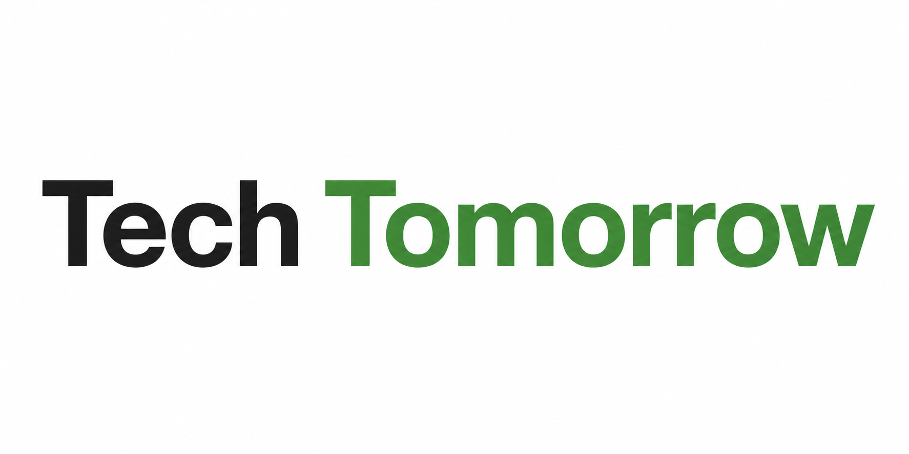

<div align="center">
  

  # 🌟 SARTHI (Capacity Connect)
  
  ### *Empowering Practical Tech Education & Career Acceleration*

  [](https://nextjs.org/)
  [](https://tailwindcss.com/)
  [](https://www.typescriptlang.org/)
  [](https://www.prisma.io/)
  [](https://www.mysql.com/)

  <p align="center">
    <a href="https://sarthi-woad.vercel.app" target="_blank">
      
    </a>
  </p>

  <p align="center">
    <a href="#-features">Features</a> •
    <a href="#%EF%B8%8F-tech-stack">Tech Stack</a> •
    <a href="#%EF%B8%8F-architecture--flows">Architecture</a> •
    <a href="#-getting-started">Getting Started</a> •
    <a href="#-environment-setup">Environment</a>
  </p>
</div>

---

## 🚀 Vision

**SARTHI** (Capacity Connect) is an advanced, high-fidelity learning management and educational platform designed to make high-quality, practical tech education accessible, interactive, and engaging. It integrates real-time collaboration tools, structured learning paths, automated credentials, and advanced analytics into one seamless, modern dashboard.

---

## ✨ Features

### 🎓 Dynamic Classrooms & Live Learning
*   **Waiting Rooms**: Professional, pre-class gating systems for students to join when instructors start classes.
*   **Video Integration**: Live streaming, screen sharing, and interactive class panels built with **LiveKit** and **Jitsi**.
*   **Course Builder**: Drag-and-drop course designer with structured modules, drag-reorder capabilities, and real-time auto-saving.

### 🏆 Gamified Progression & Certification
*   **Progress Tracking**: Database-backed learning progress tracking with premium Framer Motion module passes.
*   **Advanced Certifications**: Automatically generated premium PDF certificates with auto-issuance, verification links, and direct LinkedIn sharing.
*   **Secure Exams**: Paid certification examinations integrated with payment gateways to verify credentials.

### 💳 Subscriptions & Payments
*   **Razorpay Integration**: Native checkout flows for one-off certification purchases and recurring monthly subscription programs.
*   **Induction Portal**: Premium creator onboarding flow, OTP verification cards, and mentor profile validation interfaces.

### 💻 Developer Sandbox & Rich Editors
*   **Interactive Code Sandbox**: Monaco Editor sandbox integrations for hands-on, directly in-browser coding assessments.
*   **Rich Text Editor**: TipTap-based editorial tools supporting inline formatting, link insertion, and direct image uploads.

---

## 🛠️ Tech Stack

| Layer | Technologies |
|---|---|
| **Frontend** | React 19, Next.js 16 (App Router), TypeScript, Framer Motion, Radix UI |
| **Styling** | Tailwind CSS v4, CSS Custom Variables |
| **Backend** | Next.js API Routes, Node.js, Socket.io (Real-Time Communication) |
| **Database & ORM** | Prisma Client, MySQL 8 |
| **Payments** | Razorpay SDK (One-time Payments & Recurring Subscriptions) |
| **Media & Live** | LiveKit Client/Server SDK, Mux Player, HLS.js, Jitsi React SDK |
| **Utilities** | Monaco Editor, React PDF Renderer, TipTap Rich Editor, Web Push Notifications |

---

## ⚙️ Getting Started

### 📋 Prerequisites
*   Node.js `>= 20.9.0`
*   MySQL Server running locally or on a cloud instance (e.g. Aiven, PlanetScale)

### 💻 Local Development Setup

1. **Clone the repository and install dependencies:**
   ```bash
   git clone https://github.com/mohitraj8503/SARTHI.git
   cd SARTHI
   npm install
   ```

2. **Set up the Database schemas:**
   ```bash
   # Generate Prisma Client structures
   npm run db:generate
   
   # Push schema changes to your MySQL database
   npm run db:push
   
   # (Optional) Seed initial roles/mock data
   npm run db:seed
   ```

3. **Run the local development server:**
   ```bash
   npm run dev
   ```
   *Your local platform will be running at [http://localhost:3000](http://localhost:3000).*

---

## 📦 Production Commands

*   **Clean and build the app bundle:**
    ```bash
    npm run build
    ```
*   **Start the custom production server:**
    ```bash
    npm run start
    ```
*   **Start production server optimized for Hostinger VM:**
    ```bash
    npm run start:hostinger
    ```

---

## 🔒 Security & Optimization

*   **Max Memory Optimization**: High-performance scripts pre-configured to allocate memory pools up to 8GB for smooth Next.js builds.
*   **Authentication Gates**: Encrypted state variables, verified JWT tokens, and secure HTTP-Only cookies to protect student and grading endpoints.
